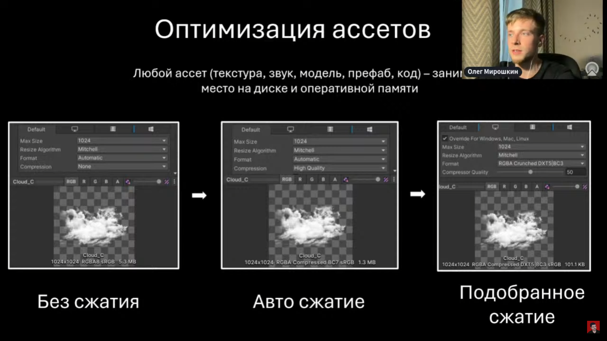
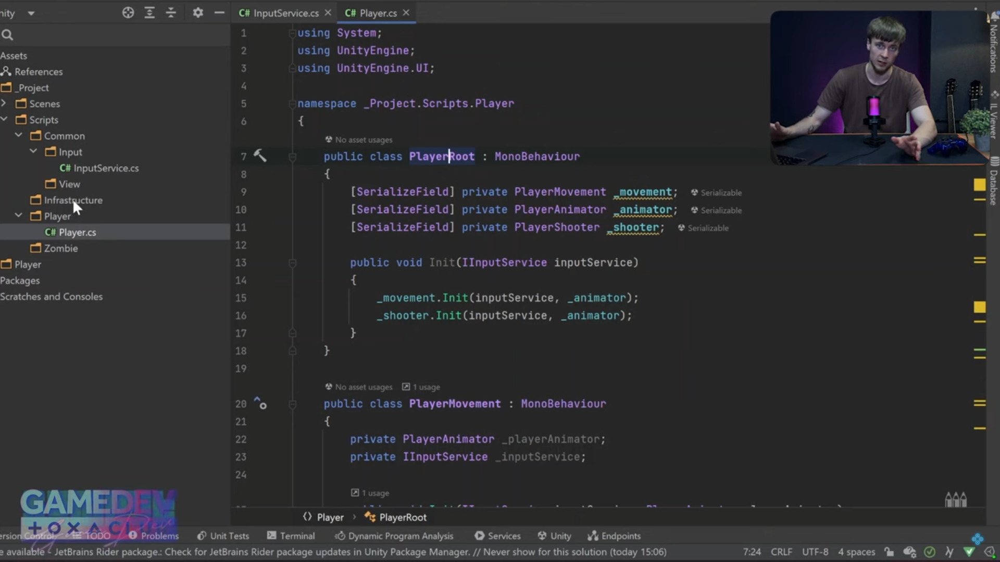

# Miroshkin Oleg

## Unity Developer with 5+ years of commercial experience.

## My lectures / performances

### [Optimizing the game for WebGL](https://www.youtube.com/live/fijJiEET78k?si=_hAapzojvYIg3huA&t=6690)

### [Designing Unity architecture using a test task as an example.](https://youtu.be/yaTJbfq-9M0?si=11ZQKSt2Y2VZ8pD2)

