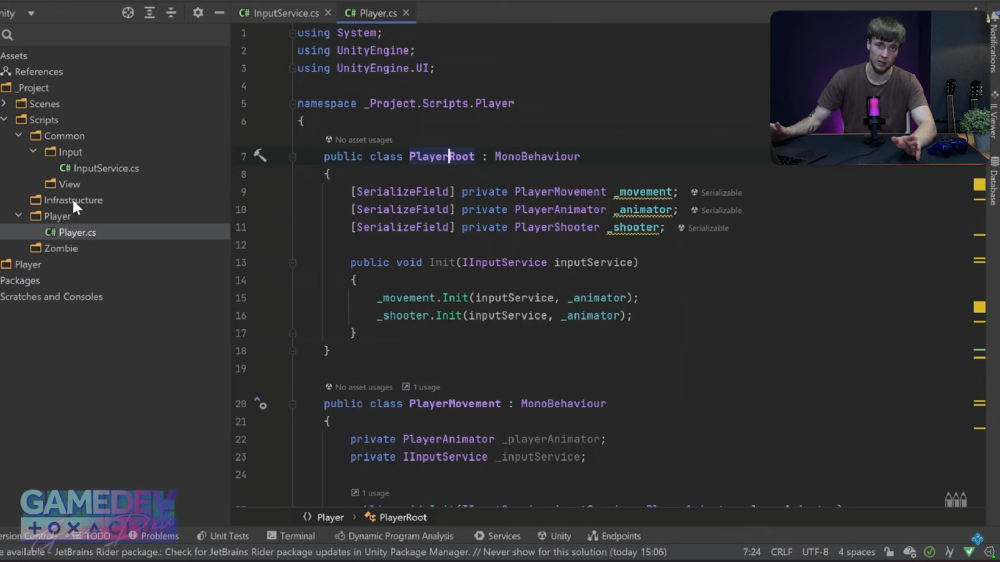

# Miroshkin Oleg

## Unity Developer with 5+ years of commercial experience.

I can be valuable for you in a role of:

- Unity Developer. [Check my CV](https://docs.google.com/document/d/1KyOYkXZYDqRV7Rz2QJq6YnYop8IBtvXU/edit?usp=sharing&ouid=100872973198092293754&rtpof=true&sd=true)
- Personal mentor to improve your Unity developer skills. Write me to olegmiroshkindev@gmail.com
- Speaker at online conferences (see information below)

## My lectures / performances

### [Optimizing the game for WebGL](https://www.youtube.com/live/fijJiEET78k?si=_hAapzojvYIg3huA&t=6690)

### [Designing Unity architecture using a test task as an example.](https://youtu.be/yaTJbfq-9M0?si=11ZQKSt2Y2VZ8pD2)

